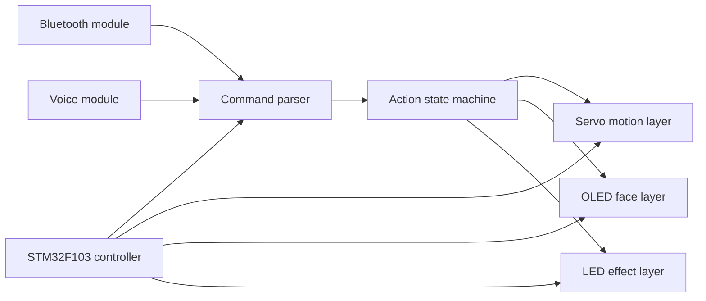

# stm32-desk-pet-extension-playbook

Public-safe documentation and clean-room examples for secondary development around an STM32 desktop pet project.

## Upstream Reference

This repository is built as a portfolio-safe companion to the upstream hardware project:

- Upstream project: [Sngels_wyh / STM32 Smart Desktop Pet](https://oshwhub.com/sngelswyh/stm32-smart-desktop-pet)
- Upstream platform: `OSHWHub`
- Public article reference: [CSDN project article](https://blog.csdn.net/2402_83438920/article/details/145213286)
- Observed upstream license: `GPL 3.0`

The local project header comment explicitly points to the OSHWHub page above, so this upstream is cited before any public publication.

This repo does **not** re-upload the original firmware source or private local modifications. It focuses on:

- architecture understanding
- extension planning
- clean-room examples
- publication-safe attribution

## What This Repo Covers

- STM32F103 desktop pet module breakdown
- action state machine interpretation
- dual command-input idea for Bluetooth and voice modules
- OLED expression and servo action expansion planning
- AI-assisted refactor notes for later secondary development

## Why This Exists

The original project already demonstrates a strong embedded interaction prototype: servo movement, Bluetooth control, voice-triggered actions, OLED face rendering, and LED breathing effects.

For portfolio use, the safer public approach is not to upload a private modified copy directly. Instead, this repo documents the engineering understanding and the extension directions developed during private experimentation.

## Repository Structure

- [`docs/upstream-reference.md`](./docs/upstream-reference.md): source attribution and publication boundary
- [`docs/module-breakdown.md`](./docs/module-breakdown.md): module-level understanding of the base desk pet project
- [`docs/extension-roadmap.md`](./docs/extension-roadmap.md): ideas for action, expression, and voice extensions
- [`examples/command_map.example.json`](./examples/command_map.example.json): sanitized action command mapping
- [`examples/action_dispatch_example.c`](./examples/action_dispatch_example.c): clean-room dispatch-table example
- [`NOTICE.md`](./NOTICE.md): attribution, license, and public release scope

## System View

## Public-Safe Highlights

- documents a real embedded interaction project without leaking private files
- shows understanding of state-driven motion control
- demonstrates how to prepare derivative work responsibly when upstream is GPL
- turns private experimentation into reusable portfolio material

## Secondary Development Themes

- modularize motion actions into clearer dispatch tables
- separate command decoding from behavior execution
- expand OLED expression presets and action-emotion pairing
- reserve hooks for offline voice command sets or AI-assisted interaction flows

## Publication Note

If you want to publish actual firmware modifications derived from the upstream code, you should work from the original upstream project and comply with its license requirements:

- [Sngels_wyh / STM32 Smart Desktop Pet](https://oshwhub.com/sngelswyh/stm32-smart-desktop-pet)

This repository is intentionally documentation-first and does not replace the upstream project.
