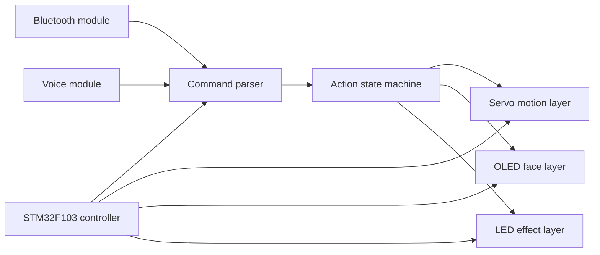

# stm32-desk-pet-extension-playbook

[Chinese Version](./README_zh.md)

This repository is where I keep my notes for extending an STM32 desktop pet project.

What interests me most in this project is not only the finished behavior, but the interaction structure behind it: how Bluetooth and voice commands map into actions, how OLED expressions stay in sync with movement, and how the control logic can be refactored into something easier to expand.

## Upstream

- Project: [Sngels_wyh / STM32 Smart Desktop Pet](https://oshwhub.com/sngelswyh/stm32-smart-desktop-pet)
- Platform: `OSHWHub`
- Public article: [CSDN project article](https://blog.csdn.net/2402_83438920/article/details/145213286)
- License observed: `GPL 3.0`

The local source tree I studied points back to the OSHWHub project above. This repository keeps my architecture notes, module breakdowns, and small clean-room examples while the actual derivative firmware work stays separate.

## What I keep here

- module breakdown notes for the original project
- action-state and command-routing observations
- extension ideas for OLED expressions, servo actions, and command handling
- clean-room examples for dispatch-table style refactors

## Repository structure

- [`docs/upstream-reference.md`](./docs/upstream-reference.md) source relationship and license context
- [`docs/module-breakdown.md`](./docs/module-breakdown.md) module-level reading notes
- [`docs/extension-roadmap.md`](./docs/extension-roadmap.md) where I would push the project next
- [`examples/command_map.example.json`](./examples/command_map.example.json) action command mapping
- [`examples/action_dispatch_example.c`](./examples/action_dispatch_example.c) dispatch-table refactor sketch
- [`NOTICE.md`](./NOTICE.md) attribution and release boundary

## System view

## What I find valuable in this project

- it already has a strong input -> state -> behavior structure
- movement and expression are tightly connected, which makes it fun to extend
- the codebase is a good candidate for command normalization and dispatch cleanup
- it is a practical embedded interaction project instead of a toy example

## Next directions

- separate command decoding from action execution
- refactor repeated branches into dispatch tables
- expand expression presets and emotion-to-action pairing
- leave cleaner hooks for offline voice keywords or AI-assisted interaction

## Note

If you plan to publish actual derivative firmware, review the upstream project and its license terms first:

- [Sngels_wyh / STM32 Smart Desktop Pet](https://oshwhub.com/sngelswyh/stm32-smart-desktop-pet)
