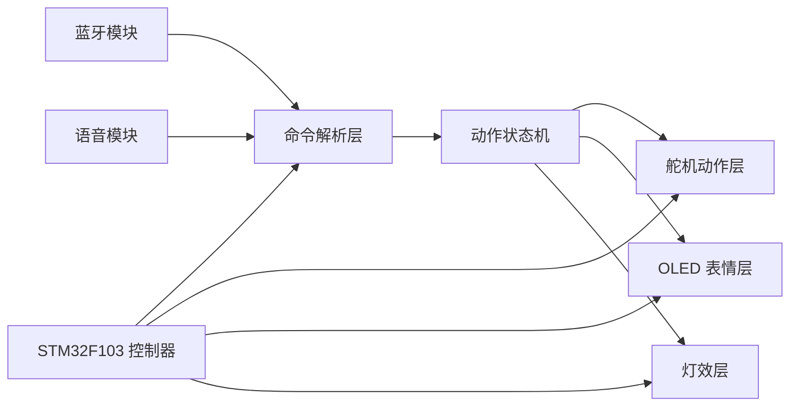

# stm32-desk-pet-extension-playbook

[English Version](./README.md)

这个仓库更像我整理 STM32 桌宠项目扩展思路时留下来的一本工作笔记。

我对这个项目最上头的地方，不只是“它能动”，而是它背后那套交互结构。蓝牙和语音命令怎么落到动作上，OLED 表情怎么跟动作状态对起来，控制逻辑还有没有机会拆得更顺，这些东西对我来说比单纯往上堆功能更有意思。

## 上游项目

- 项目： [Sngels_wyh / STM32 Smart Desktop Pet](https://oshwhub.com/sngelswyh/stm32-smart-desktop-pet)
- 平台：`OSHWHub`
- 公开文章： [CSDN project article](https://blog.csdn.net/2402_83438920/article/details/145213286)
- 观察到的许可证：`GPL 3.0`

我手上分析过的本地源码，头注释能对应到上面的 OSHWHub 页面。这里主要保留的是我整理出来的模块理解、结构拆解和一些 clean-room 小示例，真正的衍生固件工作会放在别的地方继续做。

## 这里主要放什么

- 原项目的模块拆解笔记
- 动作状态机和命令路由方面的观察
- OLED 表情、舵机动作和输入处理的扩展思路
- 面向 dispatch table 重构的小型示例

## 仓库结构

- [`docs/upstream-reference.md`](./docs/upstream-reference.md) 来源关系和许可证背景
- [`docs/module-breakdown.md`](./docs/module-breakdown.md) 模块级阅读整理
- [`docs/extension-roadmap.md`](./docs/extension-roadmap.md) 我觉得适合继续推进的方向
- [`examples/command_map.example.json`](./examples/command_map.example.json) 动作命令映射
- [`examples/action_dispatch_example.c`](./examples/action_dispatch_example.c) dispatch table 重构草图
- [`NOTICE.md`](./NOTICE.md) 来源说明和发布边界

## 系统视图

## 我觉得这个项目有意思的地方

- 它已经有比较完整的“输入 -> 状态 -> 行为”结构
- 动作和表情之间的联动很适合继续往下扩
- 很适合做命令归一化和 dispatch table 重构
- 它是个挺实在的嵌入式交互项目，不只是拼几个功能点

## 后面可能会继续往哪做

- 把命令解析和动作执行再拆开一点
- 把重复分支整理成 dispatch table
- 增加更多表情预设和情绪到动作的配对
- 给离线语音关键词或者 AI 辅助交互留出更清楚的接口

## 说明

如果后面要公开发真正的衍生固件，还是得先回到上游项目和它的许可证要求：

- [Sngels_wyh / STM32 Smart Desktop Pet](https://oshwhub.com/sngelswyh/stm32-smart-desktop-pet)
